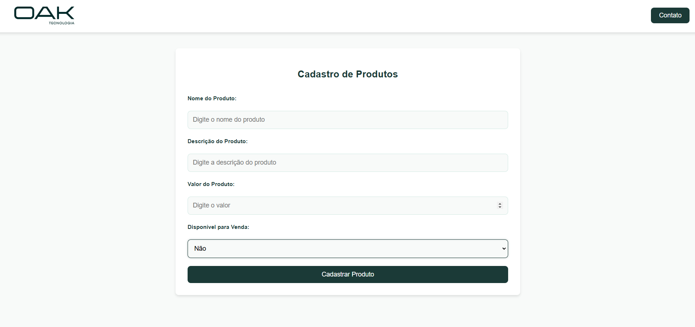
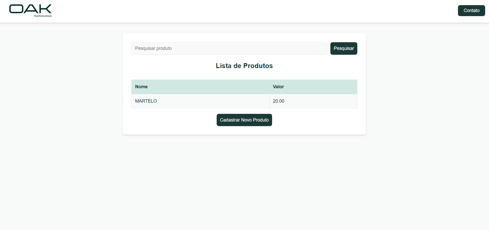

# Cadastro e Listagem de Produtos

Este é um projeto simples e responsivo que permite **cadastrar** e **listar produtos**, além de oferecer a funcionalidade de um botão de contato integrado ao WhatsApp.

---

## 📷 Demonstração do Projeto

### Tela de Cadastro

### Tela de Listagem

---

## 🚀 Funcionalidades do Projeto

1. **Cadastro de Produtos**
   - Campos: Nome, Descrição, Valor e Disponibilidade para venda (Sim/Não).
   - Botão de envio que salva o produto e o adiciona à lista.

2. **Listagem de Produtos**
   - Produtos ordenados pelo valor (menor para maior).
   - Campo de pesquisa para filtrar produtos pelo nome.
   - Botão para cadastrar novos produtos.

3. **Botão de Contato**
   - Redireciona para o WhatsApp com mensagem pré-definida.

---
